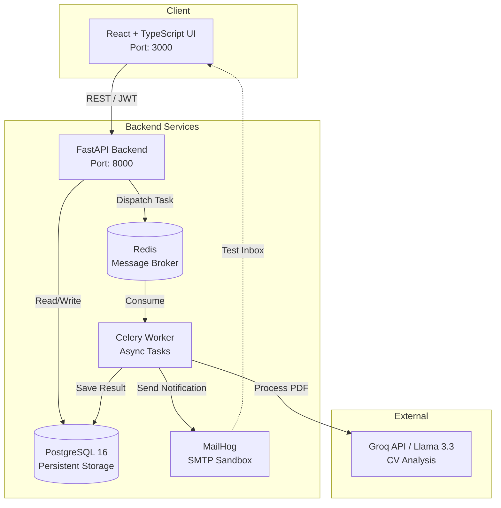

**humflow-demo – Updated README (WebSocket status clarified)**  

---  

# humflow-demo  

**Piattaforma HR Fullstack con Analisi CV Automatizzata e Architettura a Microservizi**  

`humflow-demo` è un'applicazione enterprise-grade progettata per automatizzare e ottimizzare il flusso di gestione delle risorse umane. Il sistema permette l'upload di CV in formato PDF, ne estrae automaticamente le informazioni chiave tramite Intelligenza Artificiale, e gestisce lo stato dei candidati attraverso una dashboard reattiva, orchestrando il tutto tramite task asincroni per garantire scalabilità e resilienza.  

## Panoramica Architetturale  

Il progetto è stato concepito non come un monolite, ma come un'architettura distribuita e containerizzata, separando nettamente le responsabilità per massimizzare la manutenibilità e la scalabilità orizzontale.  



*(Nota: GitHub renderizzerà automaticamente questo blocco come un diagramma visivo)*  

## Tech Stack  

| Componente | Tecnologia | Motivazione Architetturale |
| --- | --- | --- |
| **Frontend** | React 18, TypeScript, Tailwind CSS | Type-safety e sviluppo rapido di interfacce reattive e manutenibili. |
| **Backend API** | Python, FastAPI, Uvicorn | Performance asincrone native e validazione dati robusta tramite Pydantic. |
| **Task Queue** | Celery, Redis | Gestione affidabile di operazioni I/O-bound (analisi AI) senza bloccare il thread principale dell'API. |
| **Database** | PostgreSQL 16 | Affidabilità, supporto JSONB e integrità referenziale per i dati strutturati dei candidati. |
| **Infrastructure** | Docker, Docker Compose | Riproducibilità dell'ambiente di sviluppo e isolamento netto dei servizi. |
| **Testing** | MailHog | Sandbox SMTP per testare flussi di notifica in isolamento, senza inquinare ambienti reali. |

## Scelte Architetturali (Architecture Decision Records)

1. **Separazione API / Worker (Pattern Producer-Consumer)**  
   L'analisi di un PDF e la successiva chiamata a un'API di LLM sono operazioni con latenza variabile (1‑3 secondi). Eseguirle in modo sincrono all'interno della richiesta HTTP avrebbe bloccato i worker di FastAPI, degradando l'esperienza utente sotto carico. Delegando il task a Celery, l'API risponde immediatamente, garantendo alta disponibilità e permettendo al frontend di **fare polling** o, in futuro, usare **WebSocket** per il risultato.  

2. **Scelta di FastAPI rispetto a Django/Flask**  
   FastAPI è stato selezionato per il suo supporto nativo all'asincronia (`async`/`await`) e per la generazione automatica della documentazione OpenAPI (Swagger), fondamentale per un'architettura che potrebbe evolvere verso un ecosistema di microservizi più ampio e per l'integrazione con team frontend separati.  

3. **Redis come Message Broker**  
   Sebbene RabbitMQ o Kafka siano alternative valide per code complesse o ad alto throughput, Redis è stato scelto per questo progetto per la sua leggerezza, facilità di configurazione in Docker Compose e prestazioni eccellenti per code di task semplici e transienti.  

> **⚠️ Nota importante sul WebSocket**  
> Nella sezione precedente il README menziona il WebSocket solo come *possibile alternativa* al polling per comunicare i risultati dei task al frontend. **Attualmente il progetto non implementa alcun canale WebSocket/Socket.IO**; la comunicazione frontend‑backend avviene esclusivamente tramite richieste REST/JWT. Se si desidera ottenere aggiornamenti in tempo reale senza polling, sarà necessario aggiungere un layer WebSocket (ad es. Socket.IO) sia al backend FastAPI che al frontend React.

## Prerequisiti  

- [Docker](https://www.docker.com/) e [Docker Compose](https://docs.docker.com/compose/) installati e in esecuzione.  
- Una API Key valida per [Groq](https://console.groq.com) (per l'analisi AI dei CV).  

## Avvio Rapido (Quick Start)  

L'intera infrastruttura (5 servizi) può essere avviata localmente con un singolo comando.  

1. **Clona il repository**  

   ```bash
   git clone https://github.com/fabio-cerundolo/humflow-demo.git
   cd humflow-demo
   ```

2. **Configura le variabili d'ambiente**  

   Crea un file `.env` nella root del progetto basandoti su `.env.example`:  

   ```env
   GROQ_API_KEY=la_tua_api_key_qui
   # Le altre variabili (DB, Redis, SMTP) sono preconfigurate per l'ambiente Docker locale
   ```

3. **Avvia l'infrastruttura**  

   ```bash
   docker-compose up --build
   ```

   *Nota: Al primo avvio, Docker scaricherà le immagini e costruirà i container. Potrebbe richiedere alcuni minuti.*  

4. **Accedi alle applicazioni**  

   - **Frontend Dashboard**: [http://localhost:3000](http://localhost:3000)  
   - **Documentazione API (Swagger)**: [http://localhost:8000/docs](http://localhost:8000/docs)  
   - **MailHog (Sandbox Email)**: [http://localhost:8025](http://localhost:8025)  

## Struttura del Progetto  

```
humflow-demo/
├── frontend/                 # Applicazione React + TypeScript
│   ├── src/
│   └── package.json
├── backend/                  # Applicazione FastAPI
│   ├── app/
│   │   ├── api/              # Endpoint REST
│   │   ├── core/             # Configurazione e dipendenze
│   │   ├── models/           # Modelli Pydantic e SQLAlchemy
│   │   └── tasks/            # Definizione dei task Celery
│   ├── celery_worker.py      # Entry point del worker asincrono
│   └── requirements.txt
├── docker-compose.yml        # Orchestrazione dei 5 servizi
├── .env.example              # Template delle variabili d'ambiente
└── README.md
```

## Sicurezza e Best Practices  

- **Gestione dei Segreti**: Le credenziali (API Key, DB password) non sono mai committate nel repository. In un ambiente di produzione, verrebbero iniettate tramite un Secrets Manager (es. AWS Secrets Manager, HashiCorp Vault) o variabili d'ambiente del orchestrator.  
- **Validazione degli Input**: Tutti i payload in ingresso sono rigorosamente validati tramite Pydantic per prevenire injection e garantire l'integrità dei dati.  
- **Isolamento della Rete**: I servizi Docker comunicano su una rete interna definita in `docker-compose.yml`, esponendo all'host solo le porte strettamente necessarie.  

## Scalabilità Futura  

L'architettura è già predisposta per la scalabilità orizzontale:  

- È possibile aumentare il numero di istanze del worker Celery (`docker-compose up --scale worker=3`) per gestire picchi di upload di CV senza modificare il codice.  
- Il database PostgreSQL può essere facilmente migrato verso un'istanza gestita (es. AWS RDS) con repliche di lettura per separare i carichi di scrittura e lettura.  

## Possibili Miglioramenti (Roadmap)  

1. **Implementare WebSocket / Socket.IO**  
   - Aggiungere un endpoint WebSocket nel backend FastAPI (es. usando `fastapi-socketio` o integrando direttamente `socket.io`).  
   - Aggiornare il frontend React per aprire una connessione Socket.IO e ascoltare eventi quali `task-completed`, `task-progress`, ecc.  
   - Rimuovere gradualmente il meccanismo di polling in favore di notifiche push in tempo reale.  

2. **Monitoraggio e Logging Centralizzato**  
   - Integrazione di Loki/Prometheus + Grafana per osservabilità dei servizi.  
   - Strutturare i log in JSON e inviarli a un sistema di log aggregation (ELK, Loki).  

3. **CI/CD Automato**  
   - Pipeline GitHub Actions che costruiscono le immagini Docker, eseguono test unitari/integration e deploy su un cluster Kubernetes o su un servizio gestito (AWS ECS, Azure Container Apps, ecc.).  

4. **Autenticazione basata su Refresh Token**  
   - Implementare un flow di refresh token sicuro per evitare di esporre frequentemente le credenziali.  

## Licenza  

Questo progetto è distribuito con licenza MIT. Vedere il file `LICENSE` per i dettagli.  

## Autore  

**Fabio Cerundolo** — Web Solution Architect & Full-Stack Developer  

- Portfolio: [fabio-cerundolo.dev](https://fabio-cerundolo.dev)  
- GitHub: [@fabio-cerundolo](https://github.com/fabio-cerundolo)  
- LinkedIn: [fabio-cerundolo](https://linkedin.com/in/fabio-cerundolo)  

---  

*Questo README è stato aggiornato per chiarire lo stato attuale dell'implementazione WebSocket e fornire indicazioni su come aggiungerla in futuro.*
