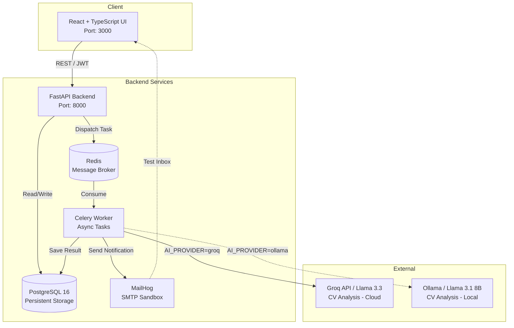

# humflow-demo

**Full-Stack HR Platform with Automated CV Analysis and Microservices Architecture**

`humflow-demo` is an enterprise-grade application designed to automate and streamline the HR management workflow. The system allows PDF CV uploads, automatically extracts key information using Artificial Intelligence, and manages candidate status through a reactive dashboard, orchestrating everything through asynchronous tasks to ensure scalability and resilience.

## Architectural Overview

The project was designed not as a monolith, but as a distributed, containerized architecture, with a clean separation of responsibilities to maximize maintainability and horizontal scalability.



*(Note: GitHub will automatically render this block as a visual diagram)*

> **Configurable AI provider**: the CV analysis step can use either **Groq** (cloud, default, requires an API key) or **Ollama** (local model, no cloud dependency, ideal for PCs without a powerful NVIDIA GPU or for offline/air-gapped environments). It's selected via the `AI_PROVIDER` variable — see the [AI Pipeline: Cloud vs Local](#ai-pipeline-cloud-vs-local) section.

## Tech Stack

| Component | Technology | Architectural Rationale |
| --- | --- | --- |
| **Frontend** | React 18, TypeScript, Tailwind CSS | Type-safety and rapid development of reactive, maintainable interfaces. |
| **Backend API** | Python, FastAPI, Uvicorn | Native async performance and robust data validation via Pydantic. |
| **Task Queue** | Celery, Redis | Reliable handling of I/O-bound operations (AI analysis) without blocking the API's main thread. |
| **Database** | PostgreSQL 16 | Reliability, JSONB support, and referential integrity for structured candidate data. |
| **Infrastructure** | Docker, Docker Compose | Reproducible development environment and clean isolation of services. |
| **Testing** | MailHog | SMTP sandbox for testing notification flows in isolation, without polluting real environments. |
| **AI Analysis** | Groq API (Llama 3.3) *or* local Ollama (Llama 3.1 8B) | Structured data extraction from the CV. Dual provider selectable via `AI_PROVIDER`: cloud for maximum speed/quality, local for zero per-call cost and no dependency on network/external API key. |

## Architecture Decision Records (ADR)

1. **API / Worker Separation (Producer-Consumer Pattern)**
   Parsing a PDF and then calling an LLM API are operations with variable latency (1–3 seconds). Running them synchronously inside the HTTP request would block FastAPI's workers, degrading the user experience under load. By delegating the task to Celery, the API responds immediately, ensuring high availability and allowing the frontend to **poll** or, in the future, use **WebSocket** for the result.

2. **Choosing FastAPI over Django/Flask**
   FastAPI was selected for its native async (`async`/`await`) support and automatic OpenAPI (Swagger) documentation generation, essential for an architecture that may evolve toward a broader microservices ecosystem and for integration with separate frontend teams.

3. **Redis as Message Broker**
   While RabbitMQ or Kafka are valid alternatives for complex or high-throughput queues, Redis was chosen for this project for its lightness, ease of configuration in Docker Compose, and excellent performance for simple, transient task queues.

4. **Interchangeable AI provider (Groq cloud / Ollama local)**
   CV analysis is isolated behind a simple switch (`AI_PROVIDER`) instead of being coupled to a single vendor. This allows using Groq in production (minimal latency, no dedicated hardware required) or Ollama locally for development, offline demos, or cost/privacy-constrained contexts where CVs must not leave the machine. The `ollama_processor.py` module returns the same JSON schema as `call_groq_for_cv`, so the rest of the pipeline (candidate creation, skills, screening, notifications) remains identical regardless of the chosen provider.

> **⚠️ Important note on WebSocket**
> The previous section mentions WebSocket only as a *possible alternative* to polling for delivering task results to the frontend. **The project currently does not implement any WebSocket/Socket.IO channel**; frontend-backend communication happens exclusively via REST/JWT requests. If real-time updates without polling are desired, a WebSocket layer (e.g. Socket.IO) would need to be added to both the FastAPI backend and the React frontend.

## Prerequisites

- [Docker](https://www.docker.com/) and [Docker Compose](https://docs.docker.com/compose/) installed and running.
- For AI-based CV analysis, one of the following:
  - a valid API key for [Groq](https://console.groq.com) (cloud provider, default), **or**
  - [Ollama](https://ollama.com) installed and running locally, with the model already pulled (e.g. `ollama pull llama3.1:8b`) — see [AI Pipeline: Cloud vs Local](#ai-pipeline-cloud-vs-local).

## Quick Start

The entire infrastructure (5 services) can be started locally with a single command.

1. **Clone the repository**

   ```bash
   git clone https://github.com/fabio-cerundolo/humflow-demo.git
   cd humflow-demo
   ```

2. **Configure environment variables**

   Create a `.env` file in the project root based on `.env.example`:

   ```env
   GROQ_API_KEY=your_api_key_here
   # Other variables (DB, Redis, SMTP) are pre-configured for the local Docker environment

   # Optional: to use a local model via Ollama instead of Groq
   # AI_PROVIDER=ollama
   ```

3. **Start the infrastructure**

   ```bash
   docker-compose up --build
   ```

   *Note: on first run, Docker will pull the images and build the containers. This may take a few minutes.*

4. **Access the applications**

   - **Frontend Dashboard**: [http://localhost:3000](http://localhost:3000)
   - **API Documentation (Swagger)**: [http://localhost:8000/docs](http://localhost:8000/docs)
   - **MailHog (Email Sandbox)**: [http://localhost:8025](http://localhost:8025)

## AI Pipeline: Cloud vs Local

CV analysis is decoupled from the provider via the `AI_PROVIDER` environment variable:

| `AI_PROVIDER` | Text extraction | Model | When to use it |
| --- | --- | --- | --- |
| `groq` (default) | `pypdf` | Llama 3.1/3.3 via [Groq API](https://console.groq.com) | Simplest setup, minimal latency, no dedicated hardware. |
| `ollama` | `PyMuPDF` | Local model (e.g. `llama3.1:8b`, `mistral:7b`, `phi3`) via [Ollama](https://ollama.com) | No per-call cost, no API key, CVs that must not leave the machine, offline environments. |

**Approximate hardware requirements for `ollama` with `llama3.1:8b` (quantized, ~5 GB):**
- at least 8 GB of free RAM (16 GB recommended, since the Docker stack runs alongside it);
- no GPU required, but on CPU alone, analyzing a CV can take anywhere from a few seconds to over a minute depending on the processor;
- with a dedicated GPU (NVIDIA via CUDA or AMD via ROCm), analysis typically drops below 5–10 seconds.

**How to enable `ollama`:**

1. Install [Ollama](https://ollama.com) on the host and pull the model:
   ```bash
   ollama pull llama3.1:8b
   ```
2. Make sure Ollama is listening on all interfaces (required because the worker, running in a container, needs to reach it from the host):
   ```bash
   # systemd (Linux)
   sudo systemctl edit ollama
   # add under [Service]:
   # Environment="OLLAMA_HOST=0.0.0.0"
   sudo systemctl restart ollama
   ```
3. In your `.env`, set:
   ```env
   AI_PROVIDER=ollama
   OLLAMA_MODEL=llama3.1:8b
   ```
4. The worker reaches Ollama via `host.docker.internal` (mapped in `docker-compose.yml` with `extra_hosts: host-gateway`, required on native Linux where this DNS name doesn't exist by default as it does on Docker Desktop).

To switch back to the cloud provider, simply remove `AI_PROVIDER` from `.env` (or set it to `groq`): no other changes are needed, as the extracted data schema is identical for both providers.

## Project Structure

```
humflow-demo/
├── frontend/                 # React + TypeScript application
│   ├── src/
│   └── package.json
├── backend/                  # FastAPI application
│   ├── app/
│   │   ├── api/              # REST endpoints
│   │   ├── core/              # Configuration and dependencies
│   │   ├── models/            # Pydantic and SQLAlchemy models
│   │   ├── services/
│   │   │   └── ollama_processor.py  # Local AI pipeline (PyMuPDF + Ollama), alternative to Groq
│   │   └── tasks/              # Celery task definitions
│   ├── celery_worker.py      # Async worker entry point
│   └── requirements.txt
├── docker-compose.yml        # Orchestration of the 5 services
├── .env.example               # Environment variables template
└── README.md
```

## Security and Best Practices

- **Secrets Management**: credentials (API keys, DB password) are never committed to the repository. In a production environment, they would be injected via a Secrets Manager (e.g. AWS Secrets Manager, HashiCorp Vault) or the orchestrator's environment variables.
- **Input Validation**: all incoming payloads are strictly validated via Pydantic to prevent injection and ensure data integrity.
- **Network Isolation**: Docker services communicate over an internal network defined in `docker-compose.yml`, exposing to the host only the strictly necessary ports.

## Future Scalability

The architecture is already designed for horizontal scalability:

- The number of Celery worker instances can be increased (`docker-compose up --scale worker=3`) to handle CV upload spikes without changing any code.
- The PostgreSQL database can easily be migrated to a managed instance (e.g. AWS RDS) with read replicas to separate write and read loads.

## Possible Improvements (Roadmap)

1. **Implement WebSocket / Socket.IO**
   - Add a WebSocket endpoint to the FastAPI backend (e.g. using `fastapi-socketio` or integrating `socket.io` directly).
   - Update the React frontend to open a Socket.IO connection and listen for events such as `task-completed`, `task-progress`, etc.
   - Gradually remove the polling mechanism in favor of real-time push notifications.

2. **Centralized Monitoring and Logging**
   - Integrate Loki/Prometheus + Grafana for service observability.
   - Structure logs in JSON and ship them to a log aggregation system (ELK, Loki).

3. **Automated CI/CD**
   - GitHub Actions pipeline that builds Docker images, runs unit/integration tests, and deploys to a Kubernetes cluster or a managed service (AWS ECS, Azure Container Apps, etc.).

4. **Refresh Token-based Authentication**
   - Implement a secure refresh token flow to avoid frequently exposing credentials.

## License

This project is distributed under the MIT license. See the `LICENSE` file for details.

## Author

**Fabio Cerundolo** — Web Solution Architect & Full-Stack Developer

- Portfolio: [fabio-cerundolo.dev](https://fabio-cerundolo.dev)
- GitHub: [@fabio-cerundolo](https://github.com/fabio-cerundolo)
- LinkedIn: [fabio-cerundolo](https://linkedin.com/in/fabio-cerundolo)

---

*This README was updated to clarify the current state of the WebSocket implementation, provide guidance on adding it in the future, and document the local AI provider (Ollama) introduced as an alternative to Groq.*
